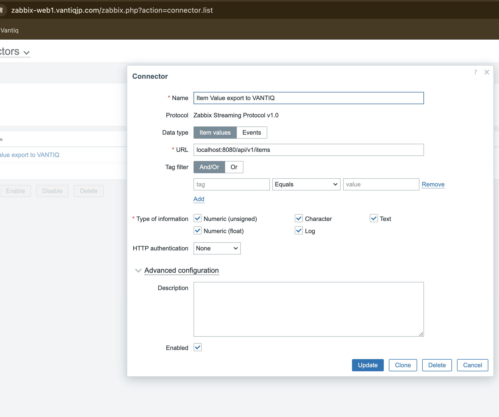

# 手順

```
cd terraform-aws-msk-kafka-cluster_with_3rd/dev
terraform init
terraform plan
terraform apply
```

```
git clone https://git.zabbix.com/scm/zt/kafka-connector.git
# Dockerfileを記述
vi Dockerfile
# confを記述
vi kafka_connector.conf

docker build -t kafka-connector .
docker run -d -p 8080:8080 kafka-connector:latest
```

構築完了後：
```
ubuntu@ip-10-0-0-208:~$ docker ps
CONTAINER ID   IMAGE                                             COMMAND                  CREATED       STATUS                 PORTS                                                                            NAMES
e348878be6ab   kafka-connector:latest                            "./kafka-connector"      8 hours ago   Up 8 hours             0.0.0.0:8080->8080/tcp, :::8080->8080/tcp                                        cool_hugle
72f19860d16c   zabbix/zabbix-server-mysql:ubuntu-7.0-latest      "/usr/bin/docker-ent…"   10 days ago   Up 10 days             0.0.0.0:10051->10051/tcp, :::10051->10051/tcp                                    zabbix-docker-700-zabbix-server-1
daade837a450   zabbix/zabbix-web-nginx-mysql:ubuntu-7.0-latest   "docker-entrypoint.sh"   11 days ago   Up 11 days (healthy)   0.0.0.0:80->8080/tcp, :::80->8080/tcp, 0.0.0.0:443->8443/tcp, :::443->8443/tcp   zabbix-docker-700-zabbix-web-nginx-mysql-1
14d6b759805c   mysql:8.0-oracle                                  "docker-entrypoint.s…"   11 days ago   Up 11 days                                                                                              zabbix-docker-700-mysql-server-1
```

# Zabbix WebUIでConnector作成
https://www.zabbix.com/documentation/7.0/en/manual/config/export/streaming#configuration

作成後対象コンテナで下記コマンドを実行、リロードサーバキャッシュらしい

Ref: 「2 Streaming to external systems」-> 「Configuration」-> 「3」
> 3. Configure a new connector in Zabbix frontend (Administration → General → Connectors) and reload the server cache with the zabbix_server -R config_cache_reload command.

- https://www.zabbix.com/documentation/7.0/en/manual/config/export/streaming

```
docker exec -it 72f19860d16c sh
zabbix_server -R config_cache_reload
```

## kafka_connector.conf

confファイル各プロパティ：
https://git.zabbix.com/projects/ZT/repos/kafka-connector/browse

kafka connector:

- Connector.Port: Kafka connector server port
- Connector.LogType: The log output type of Kafka connector.
- Connector.LogFile
- Connector.LogFileSize
- Connector.LogLevel
- Connector.BearerToken: Authorization token for incoming connections from Zabbix server.
- Connector.AllowedIP
- Connector.EnableTLS
- Connector.CertFile
- Connector.KeyFile
- Connector.Timeout

Kafka connector producer settings:

- Kafka.URL
- Kafka.Port
- Kafka.Events
- Kafka.Items
- Kafka.Retry
- Kafka.Timeout
- Kafka.KeepAlive
- Kafka.Username
- Kafka.Password
- Kafka.EnableTLS
- Kafka.TLSAuth
- Kafka.CaFile
- Kafka.ClientCertFile
- Kafka.ClientKeyFile

# 参考

- https://www.sraoss.co.jp/tech-blog/zabbix/zabbix64-newfeature-latest/
- https://www.zabbix.com/documentation/7.0/en/manual/config/export/streaming#configuration
- https://git.zabbix.com/projects/ZT/repos/kafka-connector/browse
- https://docs.aws.amazon.com/ja_jp/msk/latest/developerguide/create-topic.html

`client.properties`
```
key.serializer=org.apache.kafka.common.serialization.StringSerializer
value.serializer=org.apache.kafka.common.serialization.StringSerializer
key.deserializer=org.apache.kafka.common.serialization.StringDeserializer
value.deserializer=org.apache.kafka.common.serialization.StringDeserializer
security.protocol=PLAINTEXT
```

```
# トピック作成
./kafka-topics.sh --create --bootstrap-server b-1.exdev.ql7lgu.c6.kafka.us-west-2.amazonaws.com:9092 --command-config client.properties --replication-factor 2 --partitions 1 --topic MSKTutorialTopic

# データを生成及び消費する
./kafka-console-producer.sh --broker-list b-1.exdev.ql7lgu.c6.kafka.us-west-2.amazonaws.com:9092 --producer.config client.properties --topic MSKTutorialTopic
./kafka-console-consumer.sh --bootstrap-server b-1.exdev.ql7lgu.c6.kafka.us-west-2.amazonaws.com:9092 --consumer.config client.properties --topic MSKTutorialTopic --from-beginning

# itemsトピック作成
./kafka-topics.sh --create --bootstrap-server b-1.exdev.ql7lgu.c6.kafka.us-west-2.amazonaws.com:9092 --command-config client.properties --replication-factor 2 --partitions 1 --topic items

# itemsトピックメッセージを確認
./kafka-console-consumer.sh --bootstrap-server b-1.exdev.ql7lgu.c6.kafka.us-west-2.amazonaws.com:9092 --consumer.config client.properties --topic items --from-beginning
```

> Kafka connector can also be executed with the default kafka_connector.conf configuration file. However, by default, it will only accept connections from a Zabbix server running on localhost, and the endpoints of Kafka topics will be pre-defined.

> 2. Configure a connector in Zabbix as described on the Streaming to external systems page in Zabbix Manual. When specifying the receiver (Kafka connector) URLs in Zabbix frontend, ensure that they are specified as `http://<host>:<port>/api/v1/items` and `http://<host>:<port>/api/v1/events`



# docker logs e348878be6ab

`kafka-connector:latest`のログを確認してみたが、下記ログしか吐き出されていない。。
```
2024/06/24 04:07:31.812821 Starting server
```

下記URLに変更しても、動作は同じ
`http://172.0.0.1:8080/api/v1/items`
